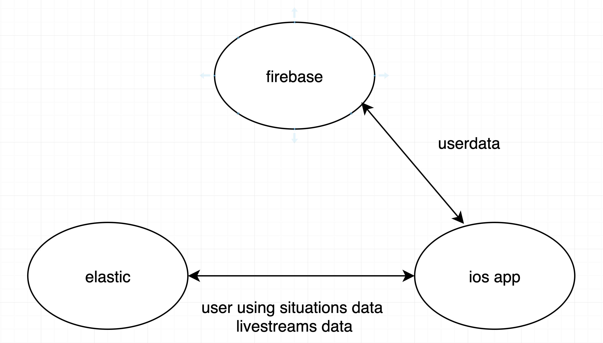

# iivenet

## Project Introduction 项目介绍

An app similar to Peak Live
## Main technology 主要技术

- elasticsearch
- firebase 
- alamofire 
- swiftyjson

## Development environment 开发环境

*XCode10.3* + *swift4.0* ，如果下载项目后，编译失败，请检查 `XCode` 版本是否满足。
If the compilation fails after downloading the project, check that the `XCode` version is met.

## Demonstration 演示图

## Podfile
pod 'Alamofire', '~> 4.4’
pod 'SwiftyJSON'
pod "YoutubePlayer-in-WKWebView", "~> 0.2.0"
pod "Kingfisher"
pod 'Material'
pod 'Firebase/Core'
pod 'Firebase/Auth'
pod 'Firebase'
pod 'FirebaseDatabase'
pod 'FirebaseAuth'
pod 'FirebaseStorage'
pod 'Firebase/InAppMessaging'
pod 'Firebase/Analytics'
pod 'Firebase/MLNLTranslate'

pod 'GoogleSignIn'
pod 'PageMenu'

pod 'TwitchPlayer'
pod 'FSPagerView'
pod 'ActionButton'
pod 'SideMenu'
pod 'SidebarOverlay'
pod 'LUExpandableTableView'
pod 'GTMRefresh'

#ElasticSearch
pod 'ElasticSwift', '~> 1.0.0-alpha.9'
pod 'ElasticSwiftCore', '~> 1.0.0-alpha.9'
pod 'ElasticSwiftQueryDSL', '~> 1.0.0-alpha.9'
pod 'ElasticSwiftCodableUtils', '~> 1.0.0-alpha.9'
pod 'ElasticSwiftNetworking', '~> 1.0.0-alpha.9'

#facebook
pod 'Bolts'
pod 'FBSDKCoreKit','~> 4.0'
pod 'FBSDKLoginKit','~> 4.0'

## CocoaPods
If you're planning on including external dependencies (e.g. third-party libraries) in your project, [CocoaPods][cocoapods] offers easy and fast integration. Install it like so:

sudo gem install cocoapods

To get started, move inside your iOS project folder and run

pod init

This creates a Podfile, which will hold all your dependencies in one place. After adding your dependencies to the Podfile, you run

pod install

to install the libraries and include them as part of a workspace which also holds your own project. For reasons stated [here][committing-pods-cocoapods] and [here][committing-pods], we recommend committing the installed dependencies to your own repo, instead of relying on having each developer run `pod install` after a fresh checkout.

Note that from now on, you'll need to open the `.xcworkspace` file instead of `.xcproject`, or your code will not compile. The command

pod update

will update all pods to the newest versions permitted by the Podfile. You can use a wealth of [operators][cocoapods-pod-syntax] to specify your exact version requirements.

[cocoapods]: https://cocoapods.org/
[cocoapods-pod-syntax]: http://guides.cocoapods.org/syntax/podfile.html#pod
[committing-pods]: https://www.dzombak.com/blog/2014/03/including-pods-in-source-control.html
[committing-pods-cocoapods]: https://guides.cocoapods.org/using/using-cocoapods.html#should-i-check-the-pods-directory-into-source-control

## Framwork

## Main viewcontrollers or views
- WelcomeController
- SignUpViewController
- LoginViewController 
- HomePageVC
- PlatformVC
- VideoCollectionView
- AccountVC
- HistoryTableViewController
- ExpanedTableView
- SearchView
- PlayerView
- VideoWebView
## Modles
- fsdvideo
- ilivenetuser
## Relations between views and viewcontrollers

## Descriptions
welcomecontrollers 負責讓使用者使用google login 和 facebook login。SignupViewController讓使用者使用email去註冊賬號，LoginViewController則讓使用者用email去登陸。當使用者登陸時，會把使用者登陸時的data(displayname,email,photourl,uid)儲存到ilivenetuser的modle儲存。
SidebarContainer會包裹兩個viewcontrollers（navc 和 expanedtableview）一個用作主頁面，另一個為sidebar。
navc 為初始頁面的navigationcontroller,當sidebar選擇不同欄位后，navc的rootviewcontroller也隨著改變。
homepagevc 和 platformvc 為兩個儲存直播內容的頁面。用pageview去存不同種類的videocollectionview。
videocollectionview 偵測到點擊動作后，會偵測影片種類，如果點擊youtube或twitch,則發出noti讓navc彈出playerview,不然則跳轉至videowebview。
searchview內嵌在navc內，當單擊navbar的search button 則發出noti彈出searchview,當user 輸入完內容，跳出存放搜索內容的videocollectionvew。
## Alamofire and swiftyjson
Alamofire.request(url).responseJSON(completionHandler: { response in
if response.result.isSuccess {
var json:JSON = []
//let json: JSON = JSON(data: response.data!)
do {
json = try JSON(data: response.data!)//讀取json檔案

} catch {
return
}    
}
})            
輸入elasticsearch db 提供的url api， 可以將db的json 資料保存到app端,然後再用swiftyjson創建一個json變數，保存response的data
## Elasticswift
let cred = BasicClientCredential(username: "elastic", password: "elastic")
let certPath = "/path/to/certificate.der"
let sslConfig = SSLConfiguration(certPath: certPath, isSelf: true)
let adaptorConfig = URLSessionAdaptorConfiguration(sslConfig: sslConfig)
let settings = Settings(forHosts: [ip], withCredentials: cred, adaptorConfig: adaptorConfig)
self.client = ElasticClient(settings: settings)
連線到server

let indexRequest = try! IndexRequestBuilder<ilivenetuser>() { builder in
_ = builder.set(index: "user")
.set(type: "ilivnetuser")
.set(id: ilivenetUser.email)
.set(source: ilivenetUser)
}
.build()
self.client.index(indexRequest, completionHandler: self.indexHandler)

向elasticdb的"user"的index裡面加入ilivenetUser的data。完成使用者使用情況的上傳
## Firebase
使用auth來login

Auth.auth().signIn(with: credential, completion: { (user, error) in}

儲存user資料到database

let database: DatabaseReference = Database.database().reference()     
database.child("users").child("\(ilivenetUser.uid)").child("email").setValue(ilivenetUser.email)
database.child("users").child("\(ilivenetUser.uid)").child("displayName").setValue(ilivenetUser.name)
let photo:String = "\(ilivenetUser.photoURL)"
database.child("users").child("\(ilivenetUser.uid)").child("photoURL").setValue(photo)

儲存user image到storage

let metaData = StorageMetadata()
metaData.contentType = "image/jpg"        
storageRef.putData(imageData, metadata: metaData) { metaData, error in}

## RNScrollPageView

self.pageView.viewControllers = controllerArray
self.pageView.titles = titles

設定好pageview的controllerarrary和對應的titles，就可生成pageview頁面

## GTMRefresh

self.GTMRefresh.gtm_addRefreshHeaderView {
[weak self] in
print("excute refreshBlock")
self?.refresh()
}

self.GTMRefresh.gtm_addLoadMoreFooterView {
[weak self] in
print("excute loadMoreBlock")
self?.loadMore()
}
self.GTMRefresh.pullDownToRefreshText("亲，试试下拉会刷新的")
.releaseToRefreshText("亲，松开试试")
.refreshSuccessText("亲，成功了")
.refreshFailureText("亲，无果")
.refreshingText("亲，正在努力刷新")

// color
self.GTMRefresh.headerTextColor(.red)

初始化用於下拉刷新和上拉載入的GTMRefresh套件

func refresh() {
perform(#selector(endRefresing), with: nil, afterDelay: 3)
}
@objc func endRefresing() {
self.fetchdata(Api: self.Api)
self.test.reloadData()
self.test.endRefreshing(isSuccess: true)
}
func loadMore() {
perform(#selector(endLoadMore), with: nil, afterDelay: 3)
}
@objc func endLoadMore() {
self.test.endLoadMore(isNoMoreData: true)
}

刷新和載入時的function，可以加入想要的動作，譬如重新載入數據

## TwitchPlayer
用於播放Twitch上直播的套件，只需輸入直播源的channel

TwitchPlayer.setChannel(to: tempvideo.channel)  

## YoutubePlayer-in-WKWebView
用於播放Youtube上直播的套件，只需輸入直播源的channel

YouTubePlayer.load(withVideoId: tempvideo.channel)
## Practical experience
- Notification    

當一個viewA需要呼叫另一個viewB的function時，在viewA內加入post,viewB加入Observer觀察post的發生，當發生post時，則執行@objc func。

NotificationCenter.default.post(name: NSNotification.Name("load"), object: nil)

NotificationCenter.default.addObserver(self, selector: #selector(loadList(notification:)), name:NSNotification.Name(rawValue: "load"), object: nil)

@objc func loadList(notification: NSNotification) {
//do anything
}

使用notification 傳值

NotificationCenter.default.post(name: notificationName, object: nil, userInfo: ["PlatformIndex":indexPath.row])

let notificationName = Notification.Name("getPlatformIndex")

NotificationCenter.default.addObserver(self, selector: #selector(getPlatformIndex(noti:)), name: notificationName, object: nil)

@objc func getPlatformIndex(noti:Notification) {
var = noti.userInfo!["PlatformIndex"] as! Int
//do something      
}

post的時候多傳入一個userinfo的值，形態任意，在observer時可以讀取userinfo的值在存到一個變數。

- Gesture

可以為一個物件添加一種手勢，當觸發手勢可以產生一個action，觸發想要的動作。
可以方便的為圖片，tableview等原件加上類似button的功能

func introduceSwipeGestureRecognizer() -> Void {

let NwSwipeGestureRecognizer = UISwipeGestureRecognizer.init(target: self, action: #selector(swipeGestureClick))
// 设置几个手指轻扫触发
NwSwipeGestureRecognizer.numberOfTouchesRequired = 1
/**
设置轻扫的方向
UISwipeGestureRecognizerDirection 方向
left : 向左
right :向右
up : 向上
down : 向下
*/
NwSwipeGestureRecognizer.direction = .left
// 添加手势
self.view.addGestureRecognizer(NwSwipeGestureRecognizer)

}

@objc func swipeGestureClick() -> Void {
if let container = self.so_containerViewController {
container.isSideViewControllerPresented = false
}

# ilivenetapp-ios
